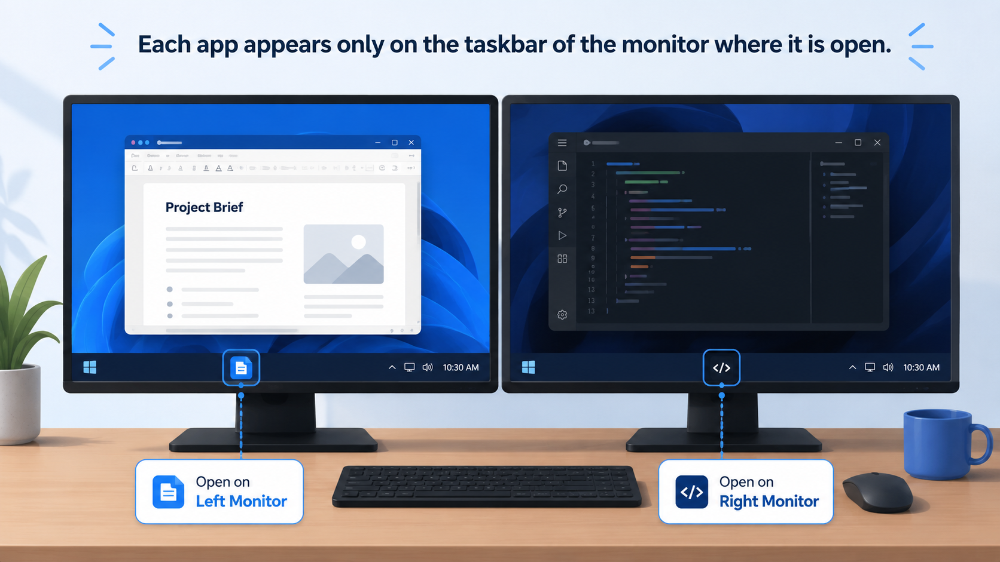

# Moor

Moor is a small, dependency-free Windows utility that applies a per-user Explorer setting at every sign-in. The setting makes taskbar buttons appear only on the taskbar of the monitor where the corresponding window is open.



The utility uses only Windows Batch files and built-in Windows commands. It writes only to `HKEY_CURRENT_USER` (`HKCU`), so it does not require administrator privileges or elevation.

> [!IMPORTANT]
> `MMTaskbarMode` is an undocumented Explorer configuration. It is not an officially supported Microsoft interface and may be changed, ignored, or removed by a future Windows update.

> [!WARNING]
> When the value needs to be changed, the utility restarts Explorer. This briefly closes and restores the taskbar, desktop shell, and open File Explorer windows. Explorer is not restarted when the value is already correct.

## Registry configuration

| Property | Value |
| --- | --- |
| Key | `HKCU\Software\Microsoft\Windows\CurrentVersion\Explorer\Advanced` |
| Value name | `MMTaskbarMode` |
| Type | `REG_DWORD` |
| Expected data | `2` (`0x2`) |

## Prerequisites

- Windows with the built-in `cmd.exe`, `reg.exe`, and `taskkill.exe` commands
- A standard interactive user account
- No third-party dependencies or administrator privileges

## Installation

Clone or download this repository, then run:

```bat
InstallAtLogin.bat
```

The installer:

1. Copies `InstallAtLogin.bat` to `%LOCALAPPDATA%\Moor\`.
2. Creates `%APPDATA%\Microsoft\Windows\Start Menu\Programs\Startup\Moor.cmd`.
3. Runs the installed script immediately.

Installation is per-user and idempotent. Running the installer again refreshes the installed script and the single startup launcher.

## Manual execution

To apply the setting without installing the startup launcher, run:

```bat
InstallAtLogin.bat --apply
```

The script is silent. It exits with code `0` if the value is already correct or was applied successfully, and returns a non-zero code if the registry update fails.

## Uninstallation

Run:

```bat
Uninstall.bat
```

The uninstaller removes the startup launcher, the installed `InstallAtLogin.bat` copy, and the `MMTaskbarMode` registry value. It then restarts Explorer so the default taskbar behavior is restored immediately. It removes `%LOCALAPPDATA%\Moor\` only if the directory is empty, so unrelated files are preserved.

## How it works

At sign-in, the startup launcher calls the installed copy of `InstallAtLogin.bat` in apply-only mode with all output suppressed. The script queries the current value and verifies its name, type, and data. If it is already `REG_DWORD 2`, the script exits without restarting Explorer. Otherwise, it writes the desired value and restarts only `explorer.exe` so the change can take effect.

## Repository structure

```text
Moor/
|-- InstallAtLogin.bat    Installs and applies the utility for the current user
|-- Uninstall.bat         Removes the installation and restores the default setting
|-- moor-taskbar-per-monitor.png  Project preview image
|-- README.md             Project documentation
|-- LICENSE               MIT License
`-- .gitignore            Common local-file exclusions
```

## License

Moor is available under the [MIT License](LICENSE).
